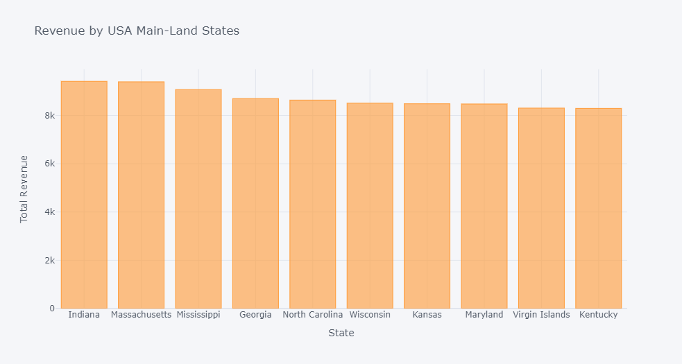
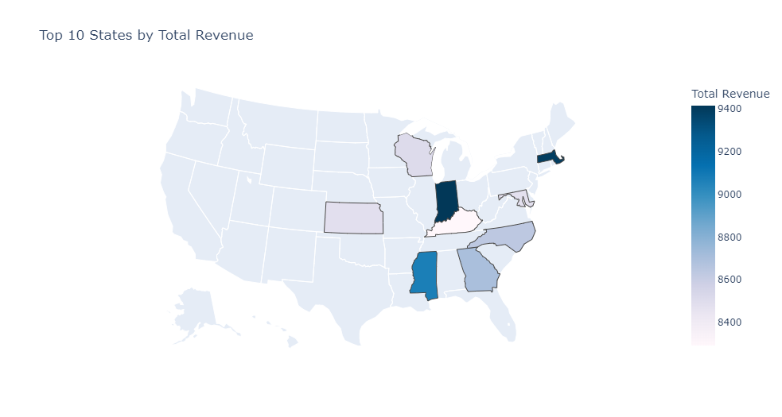

# ECommerce EDA

## Problem Statement
The Marketing and Sales teams in an ECommerce company have meetings soon and would like to get some EDA for their Ecommerece data.

## Tasks
1- Data Collection
2- Data Cleansing and Web-scraping.
3- Answering Business Questions by Analyzing Data.

Libraries used: Pandas, seaborn, requests, beatifulsoup, plotly.

