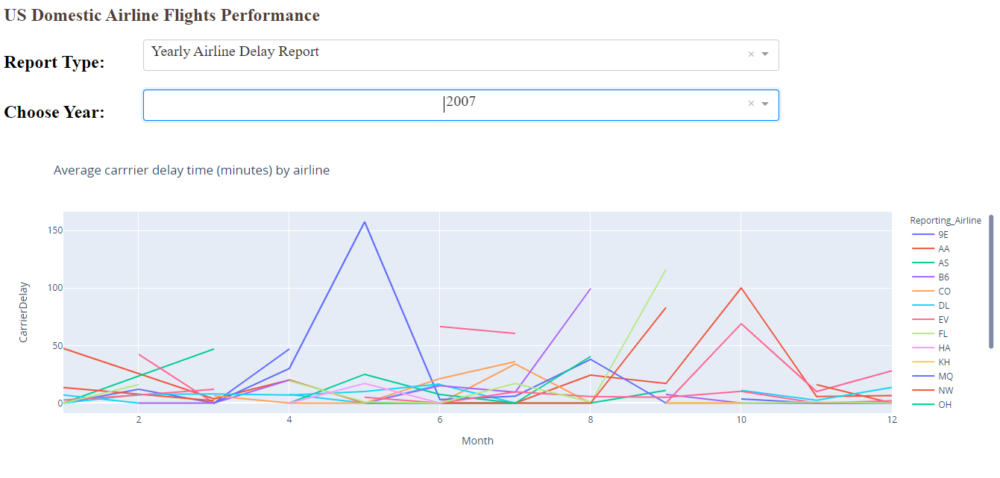
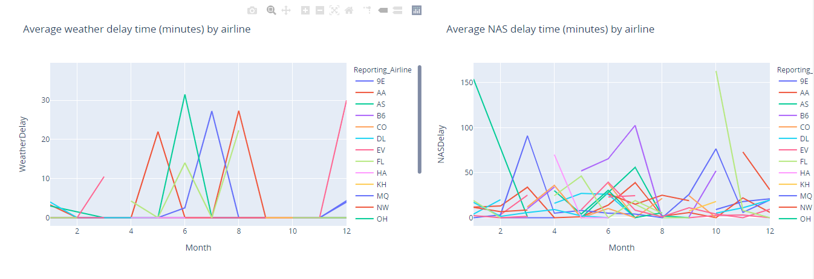
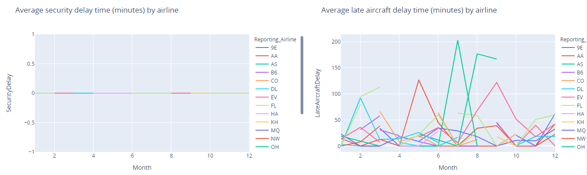
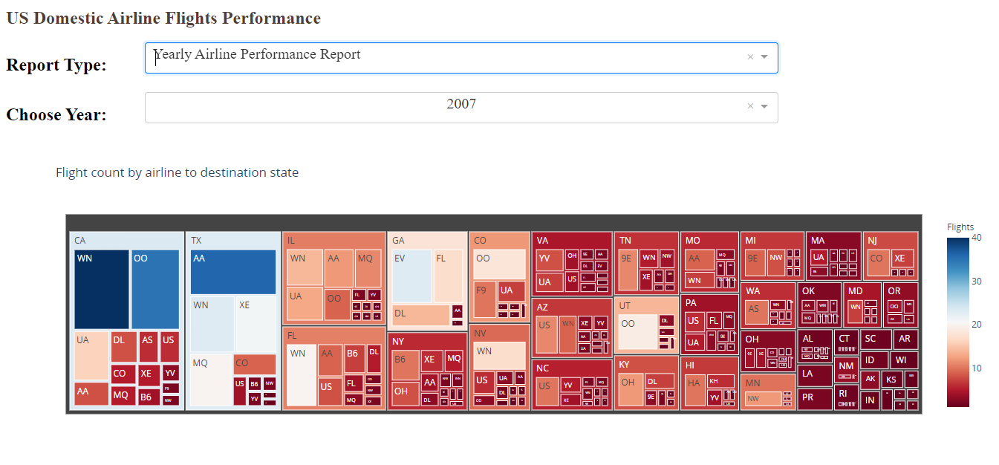
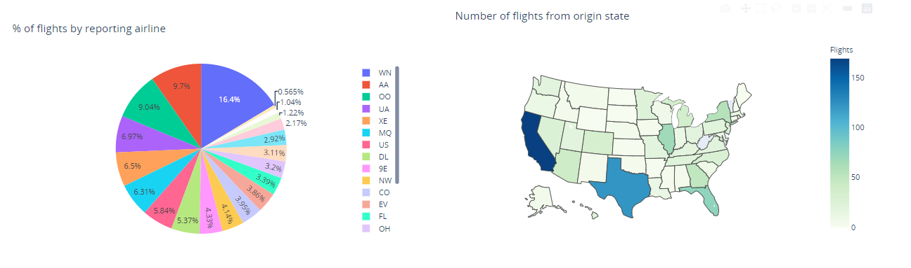
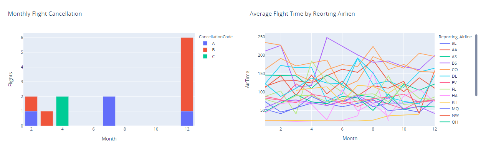

# American Airlines Delay (1987-2020) Analysis

The dataset used in this project is a sample of [The Reporting Carrier On-Time Performance Dataset](https://developer.ibm.com/exchanges/data/all/airline/) which contains information on approximately 200 million domestic US flights reported to the United States Bureau of Transportation Statistics. The dataset contains basic information about each flight (such as date, time, departure airport, arrival airport) and, if applicable, the amount of time the flight was delayed and information about the reason for the delay.

Summary: 
In this porject I constructed 2 reports;

1.  Yearly airline performance report

    For the chosen year provide,

    *   Number of flights under different cancellation categories using bar chart.
    *   Average flight time by reporting airline using line chart.
    *   Percentage of diverted airport landings per reporting airline using pie chart.
    *   Number of flights flying from each state using choropleth map.
    *   Number of flights flying to each state from each reporting airline using treemap chart.
2.  Yearly average flight delay statistics

    For the chosen year provide,

    *   Monthly average carrier delay by reporting airline for the given year.
    *   Monthly average weather delay by reporting airline for the given year.
    *   Monthly average natioanl air system delay by reporting airline for the given year.
    *   Monthly average security delay by reporting airline for the given year.
    *   Monthly average late aircraft delay by reporting airline for the given year.

