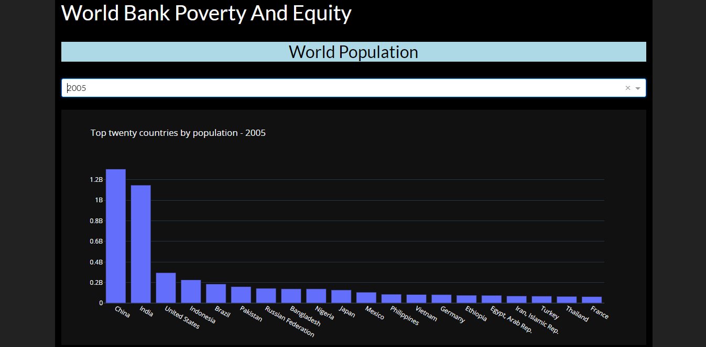
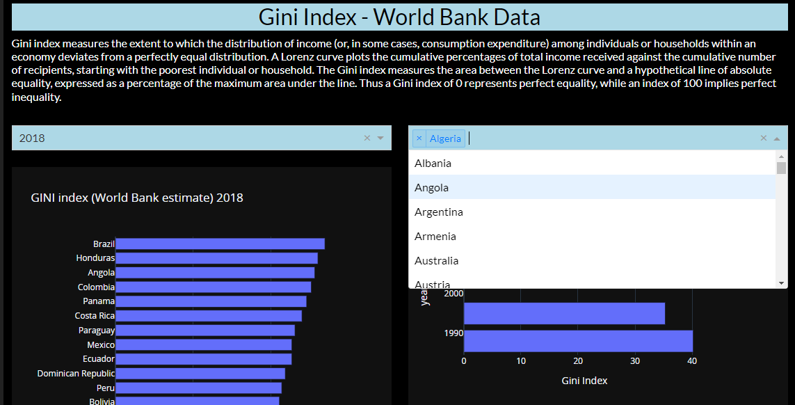
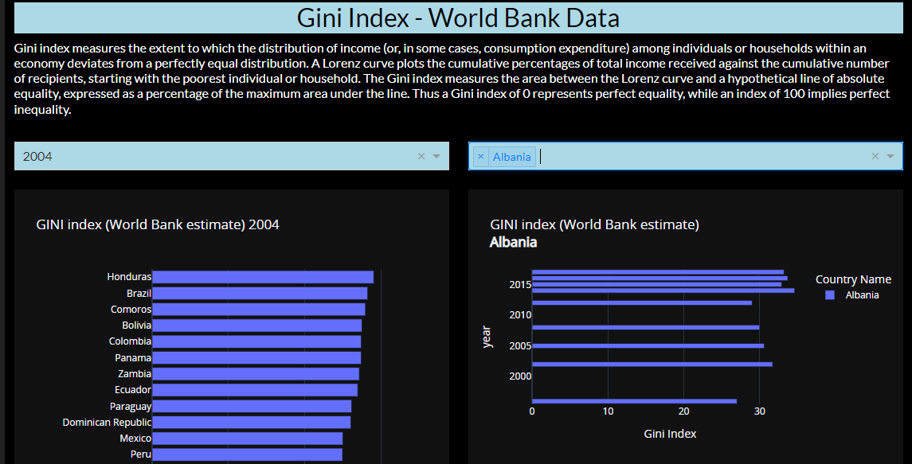
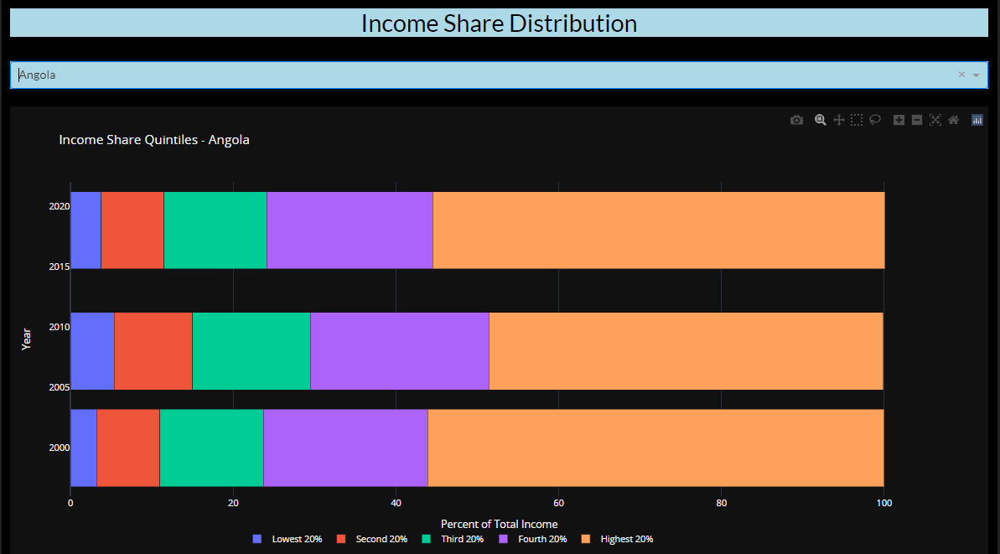
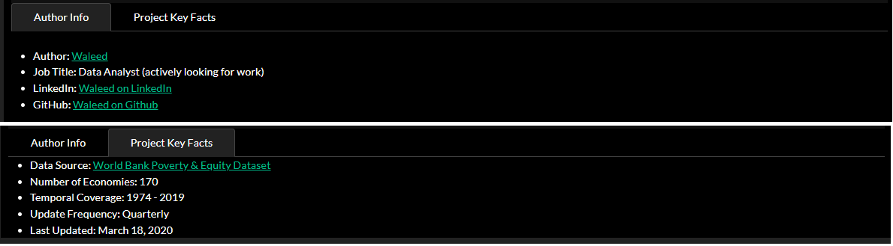

# World Bank Poverty and Equity Data Analysis and Visualization

Data Source: [World Bank Poverty & Equity Dataset](https://datacatalog.worldbank.org/dataset/poverty-and-equity-database)

## Summary:
In this project, I used a combination of Pandas, Plotly and Dash libraries to:
- Clean and transform the poverty and equity data from World bank report.
- Visualize World's population by Country in a vertical bar chart with a drop down menu for Year filtering.

- Add a section to define GINI index for non-expert reader.
- Visualize the GINI index by Country in a horizontal bar chart with a drop down menu for Year filtering.
- Visulalize the GINI index by Year in a horizontal bar chart with dropdown menu for Country multifi-filtering.

- Visualize the Income Share Distribution by Year in a stacked horizontal bar chart with a dropdown menu for Country filtering.

- Add two tabs; one for Author Info and another for Project Info.

 
